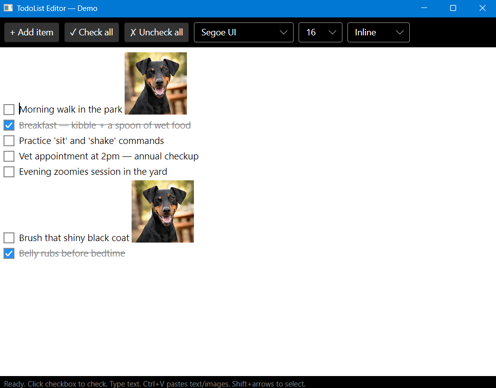

# TodoList.Avalonia

A custom rich-text todo-list editor control for [Avalonia UI](https://avaloniaui.net/), targeting .NET 10.



## Features

- Checkbox todo items with strikethrough for completed items
- Rich text editing with inline image support (markdown syntax: ``)
- Inline and block image display modes
- Multi-line text wrapping with wrapped-line-aware Home/End navigation
- Word navigation (Ctrl+Left/Right), word selection (Ctrl+Shift+Left/Right), word deletion (Ctrl+Backspace/Delete)
- Full undo/redo with coalesced typing actions
- Text selection via keyboard (Shift+arrows) and mouse (click-drag)
- Clipboard integration — paste text and images (Ctrl+V)
- Fully themeable — all colors and layout constants exposed as Avalonia `StyledProperty`
- MVVM-ready — bind to `Items` property with `ObservableCollection<TodoItemData>`
- Cross-platform via Avalonia (Windows, macOS, Linux)

## Getting Started

### Prerequisites

- [.NET 10 SDK](https://dotnet.microsoft.com/download)

### Build

```bash
dotnet build TodoList.Avalonia.slnx
```

### Run the Demo

```bash
dotnet run --project TodoList.Avalonia.Demo
```

The demo includes two windows:
- **MainWindow** — direct API usage with toolbar controls
- **MvvmWindow** — MVVM data binding with a ViewModel side panel

### Run Tests

```bash
dotnet test TodoList.Avalonia.Tests
```

## Usage

Add a reference to the `TodoList.Avalonia` project, then use the editor in your Avalonia UI application:

```csharp
var editor = new TodoListEditor
{
    DefaultFont = new FontFamily("Segoe UI"),
    DefaultFontSize = 15
};

// Add items directly
editor.Document.Items.Add(new TodoItem("Buy milk"));
editor.Document.Items.Add(new TodoItem("Walk the dog", isChecked: true));

// Or bind via MVVM
editor[!TodoListEditor.ItemsProperty] = new Binding("Items");
```

### Inline Images

Register images in the `ImageStore` dictionary, then reference them in item text:

```csharp
editor.ImageStore["star"] = myBitmap;
// Item text: "Rating:  excellent"
```

## Project Structure

```
TodoList.Avalonia/           Core library
  Controls/
    TodoListEditor.cs      Main editor control (rendering, input, selection)
  Model/
    DocumentModel.cs       TodoDocument, TodoItem, ContentElement
    TodoItemData.cs        MVVM data model with INotifyPropertyChanged
TodoList.Avalonia.Demo/      Demo application
TodoList.Avalonia.Tests/     NUnit tests (headless Avalonia)
```

## License

MIT
